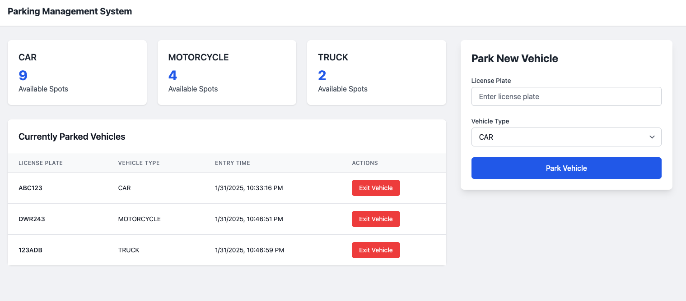

# Parking System - DevOps Demonstration Project

## Overview
This project demonstrates a modern parking management system built using microservices architecture, containerization, and DevOps principles. It serves as a proof of concept for implementing CI/CD pipelines, container orchestration, and cloud-native practices.

## Tech Stack

### Backend
- FastAPI (Python 3.11)
- PostgreSQL 13
- SQLAlchemy ORM
- Alembic for migrations

### Frontend
- React with TypeScript
- Tailwind CSS for styling
- Vite for build tooling

### DevOps Tools
- Docker & Docker Compose
- Kubernetes
- GitHub Actions for CI/CD

## Project Structure
```
parking-system/
├── backend/                 # FastAPI application
│   ├── app/
│   │   ├── api/            # API routes
│   │   ├── core/           # Core configurations
│   │   ├── crud/           # Database operations
│   │   ├── models/         # SQLAlchemy models
│   │   └── schemas/        # Pydantic models
│   ├── alembic/            # Database migrations
│   ├── Dockerfile
│   └── requirements.txt
│
├── frontend/               # React application
│   ├── src/
│   │   ├── components/    # React components
│   │   ├── services/      # API services
│   │   └── types/        # TypeScript types
│   ├── Dockerfile
│   └── package.json
│
├── kubernetes/            # Kubernetes manifests
│   ├── backend-deployment.yaml
│   ├── frontend-deployment.yaml
│   └── postgres-deployment.yaml
│
└── .github/workflows/     # GitHub Actions workflows
```

## Local Development Setup

### Prerequisites
- Docker Desktop with Kubernetes enabled
- Python 3.11+
- Node.js 18+
- kubectl CLI

### Backend Setup
1. Create and activate virtual environment:
```bash
cd backend
python -m venv venv
source venv/bin/activate  # On Windows: venv\Scripts\activate
```

2. Install dependencies:
```bash
pip install -r requirements.txt
```

3. Set up environment variables:
```bash
cp .env.example .env
# Edit .env with your configurations
```

4. Run migrations:
```bash
alembic upgrade head
```

5. Start the backend service:
```bash
uvicorn app.main:app --reload
```

### Frontend Setup
1. Install dependencies:
```bash
cd frontend
npm install
```

2. Start development server:
```bash
npm run dev
```

## Docker Deployment

### Using Docker Compose
1. Build and start services:
```bash
docker-compose up --build
```

2. Access the applications:
- Frontend: http://localhost:3000
- Backend API: http://localhost:8000
- API Documentation: http://localhost:8000/docs

### Using Kubernetes

1. Enable Kubernetes in Docker Desktop

2. Build Docker images:
```bash
# Build backend image
docker build -t parking-backend:latest ./backend

# Build frontend image
docker build -t parking-frontend:latest ./frontend
```

3. Create namespace:
```bash
kubectl create namespace parking-system
```

4. Deploy applications:
```bash
kubectl apply -f kubernetes/
```

5. Verify deployments:
```bash
kubectl get all -n parking-system
```

6. Access services:
```bash
# Get service URLs
kubectl get svc -n parking-system
```

## API Documentation

The API documentation is available at `/docs` when the backend is running. Key endpoints include:

- `POST /api/parking/park` - Park a vehicle
- `POST /api/parking/exit` - Record vehicle exit
- `GET /api/parking/current` - Get currently parked vehicles
- `GET /api/parking/available/{vehicle_type}` - Get available spots by vehicle type

## Database Migrations

### Create a new migration
```bash
alembic revision --autogenerate -m "description"
```

### Apply migrations
```bash
alembic upgrade head
```

### Rollback migration
```bash
alembic downgrade -1
```

## Testing

### Backend Tests
```bash
cd backend
pytest
```

### Frontend Tests
```bash
cd frontend
npm test
```

## CI/CD Pipeline

The project uses GitHub Actions for continuous integration and deployment. The pipeline:

1. Runs tests for both frontend and backend
2. Builds Docker images
3. Pushes images to container registry
4. Deploys to Kubernetes cluster

## Monitoring and Logging

### Kubernetes Dashboard
```bash
kubectl apply -f https://raw.githubusercontent.com/kubernetes/dashboard/v2.7.0/aio/deploy/recommended.yaml
kubectl proxy
```
Access dashboard at: http://localhost:8001/api/v1/namespaces/kubernetes-dashboard/services/https:kubernetes-dashboard:/proxy/

### View Logs
```bash
# Backend logs
kubectl logs -f -n parking-system deployment/parking-backend

# Frontend logs
kubectl logs -f -n parking-system deployment/parking-frontend

# Database logs
kubectl logs -f -n parking-system statefulset/postgres
```

## Troubleshooting

### Common Issues

1. Database Connection Issues
```bash
# Check PostgreSQL pod status
kubectl get pods -n parking-system -l app=postgres

# Check PostgreSQL logs
kubectl logs -n parking-system -l app=postgres
```

2. Service Discovery Issues
```bash
# Check services
kubectl get svc -n parking-system

# Check endpoints
kubectl get endpoints -n parking-system
```

3. Image Pull Issues
```bash
# Check image presence
docker images | grep parking

# Check pod events
kubectl describe pod -n parking-system <pod-name>
```

## Contributing

1. Fork the repository
2. Create a feature branch
3. Commit your changes
4. Push to the branch
5. Create a Pull Request

## License

This project is licensed under the MIT License - see the LICENSE file for details.